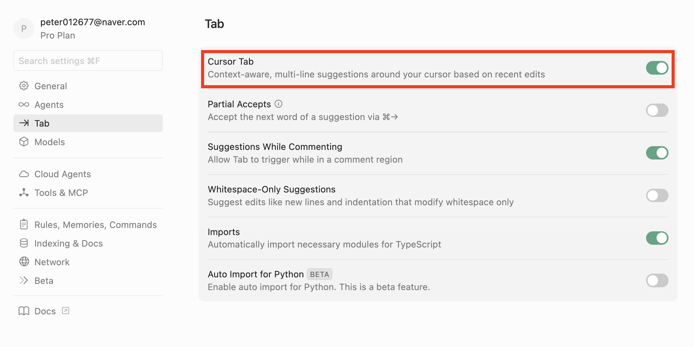

# TDD x Pair Programming 핸즈온

이 레포지토리는 2025년 11월 18일 GDG on Campus Konkuk 4차 정기세션에서 사용됩니다.

### 실행 환경 설정 방법은 각 프로그래밍 언어의 디렉토리의 README를 확인해주세요

- [Java README](./java/README.md)
- [JavaScript README](./javascript/README.md)
- [Python README](./python/README.md)


## 🚨 자동완성 임시 중지 🚨

이 프로젝트에서 구현하는 내용은 간단하며 TDD의 사이클을 전반적으로 학습하기 위해 사용됩니다.

따라서, TDD 원칙을 체험하는 실습 내용을 해칠 수 있는 자동완성 기능을 끄는 것을 강력히 권유드립니다.

### Cursor 자동완성 끄기

1. `Ctrl + Shift + P`를 눌러 명령 팔레트를 연 후 "Cursor Settings"를 엽니다.
2. 좌측에 `Tab` 메뉴를 선택한 뒤 `Cursor Tab`을 종료합니다.



### Jebrains IDE(Intellij, PyCharm) 자동완성 끄기

`File` → `Settings` → `Editor` → `General` → `Code Completion`에서 `Show suggestions as you type` 옵션을 통해 컨트롤할 수 있다.

- 체크 박스 선택시 : 자동완성 켜짐
- 체크 박스 선택 해제 : 자동완성 꺼짐


### VSCode 자동완성(코파일럿) 끄기

#### 설정에서 `Copilot` 자동완성 끄기

- `VSCode`에서 `Cmd + ,` (Mac) 또는 `Ctrl + ,` (Windows/Linux)로 설정창을 엽니다.
- 상단 검색창에 `copilot`이라고 입력해 관련 옵션을 찾습니다.
- `github.copilot.inlineSuggest.enable` 값을 `false`로 변경합니다.
  - `GUI` 환경에서는 해당 옵션의 체크박스를 해제하면 됩니다.
  - 혹은 `settings.json`에 아래 항목을 직접 추가할 수도 있습니다:
    ```json
    "github.copilot.inlineSuggest.enable": false
    ```
- 변경 후에는 `VSCode`를 재시작 하면 확실하게 적용됩니다.

#### 아이콘으로 직접 비활성화

- 인터페이스 하단 또는 상단에 있는 `Copilot` 아이콘(사람 두 명 또는 개구리 모양)을 클릭해서 `Code Completions` 또는 `자동완성 기능`을 끌 수 있습니다.
- 언어별로 끄고 싶으면 해당 언어 아이콘 옆에서 `Copilot` 옵션 메뉴를 열어 제안 기능을 `Off` 할 수 있습니다.

#### 확장 프로그램에서 비활성화

- `좌측 Extensions` 메뉴에서 `GitHub Copilot`을 선택한 뒤, `Extension` 설정에서 `Disable`하거나 특정 언어에만 활성화하도록 조절할 수 있습니다.

## 구현 내용

### 주요 메서드

#### `roll(pins)` 메서드

볼링 공을 굴려 쓰러뜨린 핀의 개수(`pins`)를 기록하는 메서드입니다.

#### `score()` 메서드

현재까지의 점수를 계산하여 반환하는 메서드입니다.

### 1단계: 'Gutter Game' (0점짜리 게임)

가장 간단한 시나리오입니다. 모든 공이 또랑으로 빠진 경우입니다.

- 20번의 투구(`roll(0)`)를 수행한 후, `score()`가 0점을 반환하는지 확인하는 테스트를 작성하십시오
- 이 테스트를 통과시키기 위한 가장 최소한의 코드를 작성합니다. (예: `score()`가 단순히 0을 반환하게 하드코딩)

### 2단계: 'All Ones' (모두 1점)

모든 공이 1개의 핀만 쓰러트렸을때, 20점이 결과로 나오는지 확인해야합니다.

- 20번의 투구(`roll(1)`)를 수행한 후, `score()`가 20점을 반환하는지 확인하는 테스트를 작성하십시오
- 1단계의 테스트와 2단계의 테스트를 모두 통과시키도록 코드를 수정합니다. 

### 3단계: 'One Spare' (스페어 처리)

이제 복잡성이 추가됩니다.

- 스페어 상황을 테스트합니다. (예: `roll(5)`, `roll(5)`, `roll(3)`, 이후 17번 `roll(0)`)
- 이 테스트를 통과시키십시오.
- 스페어 보너스를 계산하려면 이전 롤들을 '기억'해야 합니다. 두 테스트(1, 2단계)를 깨뜨리지 않으면서, 3단계 테스트를 통과시키기 위해 설계를 과감히 리팩토링하십시오. 

### 4단계: 'One Strike' (스트라이크 처리)

- 스트라이크 상황을 테스트합니다. (예: `roll(10)`, `roll(3)`, `roll(4)`, 이후 16번 `roll(0)`)
- 스트라이크 보너스 로직을 구현합니다. 스트라이크는 한 프레임에 투구가 한 번이므로, 프레임 인덱스 관리가 스페어와 달라야 할 수 있습니다.

### 5단계: 'Perfect Game' (퍼펙트 게임)

- 12번의 스트라이크(`roll(10)`)를 수행한 후, `score()`가 300점을 반환하는지 확인하는 테스트를 작성하십시오.
- 만약 4단계까지의 로직이 완벽했다면, 이 테스트는 아무런 코드 수정 없이도 통과해야 합니다. 만약 실패한다면, 엣지 케이스를 처리하도록 로직을 수정하십시오.

